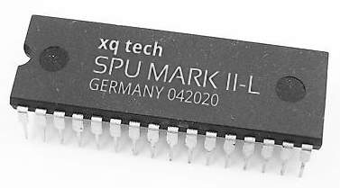

# The SPU Mark II Project

A project that focuses on the development and improvement of the *SPU Mark II* instruction
set architecture.

Another focus is development and creation of a concrete implementation of the CPU in VHDL
as well as building a small "home computer" around an FPGA board similar to other computers
from the 80ies.

## SPU Mark II

The SPU Mark II is a 16 bit *RISC*ish cpu that uses the [stack machine](https://en.wikipedia.org/wiki/Stack_machine)
approach instead of a [register machine](https://en.wikipedia.org/wiki/Register_machine) approach.

The instrution set is documented in [documentation/isa.md](documentation/isa.md).

Short feature list:
- Highly flexible instruction set
- Optional hardware multiplication/division units (WIP)
- Optional interrupt handling (WIP)

## Ashet Home Computer
The *Ashet Home Computer* is a computer built on top of the *SPU Mark II* cpu and
provides a small environment to use the cpu.

### Planned Features
- [MMU](documentation/simple-mmu.md)
- Video Output (either FBAS or VGA)
- Audio Output (signed 16 bit PCM)
- SD Card Storage
- Keyboard Interface
- Joystick Port (C64 style)
- UART interface